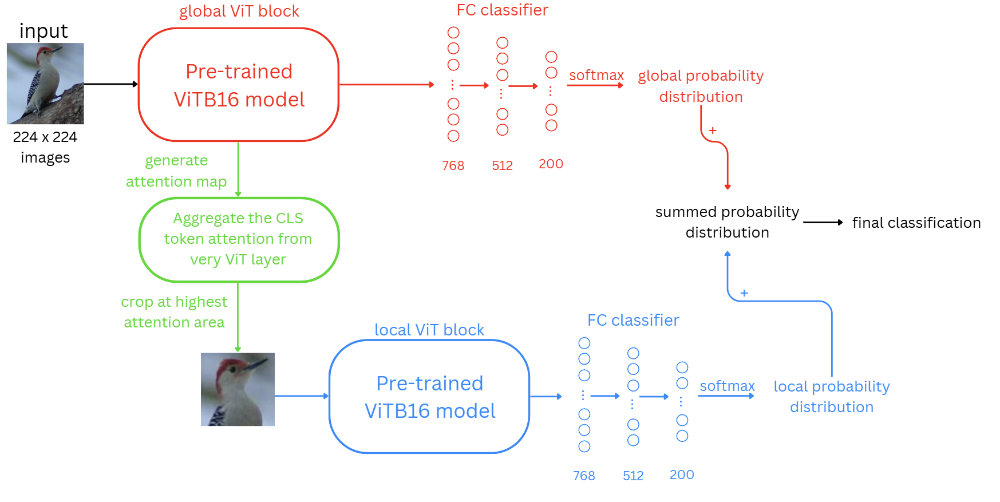

# Bird ID

Bird ID is a fine-grained bird-classification project built with PyTorch and
trained on the Caltech-UCSD Birds-200-2011 (CUB-200-2011) dataset. The primary
model is an attention-guided Vision Transformer (RA-ViT) that uses a global
image branch and an attention-guided local crop branch. A ResNet-50 classifier
is included as a baseline.

## Project Status

The repository contains the data-preparation, training, checkpoint-loading,
evaluation, and interactive prediction code used by the project. Datasets,
generated crops, training logs, plots, and model checkpoints are intentionally
excluded from Git.

## Repository Structure

```text
.
|-- scripts/
|   |-- prepare_data.py       # Extract, crop, clean, and validate CUB data
|   `-- train_ra_vit.py       # Train, resume, or fine-tune RA-ViT
|-- main/
|   `-- main.py               # PyQt6 desktop inference GUI
|-- src/
|   |-- baseline_model/
|   |   |-- baseline_model_resnet.py
|   |   `-- train_baseline.py
|   |-- data_preprocessing/
|   |   |-- data_cleaning.py
|   |   |-- data_preprocessing.py
|   |   `-- data_splitting.py
|   `-- primary_model/
|       |-- models.py
|       `-- train.py
|-- requirements.txt          # Tested direct Python dependencies
|-- tests/
|   `-- test_models.py        # Evaluation and interactive prediction utility
|-- .gitignore
`-- README.md
```

## Requirements

- Python 3.12
- The packages pinned in `requirements.txt`
- Tkinter from the Python standard library for the legacy interactive folder
  picker (not needed by the PyQt6 desktop GUI)

Create and activate an isolated environment, then install the tested dependency
versions:

```bash
python -m venv .venv
# Windows PowerShell
.venv\Scripts\Activate.ps1
python -m pip install --upgrade pip
python -m pip install -r requirements.txt
```

For CUDA, install the appropriate PyTorch and torchvision build using the
command from the official PyTorch selector before installing the remaining
requirements. Model checkpoints and the CUB dataset are not Python dependencies
and must be obtained separately as described below.

## Reproduction Workflow

Run these steps from the repository root in order:

1. Create and activate a Python 3.12 virtual environment.
2. Install the project dependencies before running any project scripts:

   ```bash
   python -m pip install --upgrade pip
   python -m pip install -r requirements.txt
   ```

3. Download `CUB_200_2011.tgz` and place it in the repository root.
4. Prepare and validate the dataset:

   ```bash
   python scripts/prepare_data.py
   ```

5. Train the RA-ViT model, or place a compatible existing checkpoint in the
   ignored `checkpoints/` directory:

   ```bash
   python scripts/train_ra_vit.py
   ```

6. Evaluate a checkpoint or launch the desktop GUI:

   ```bash
   python -m src.primary_model.evaluate --checkpoint checkpoints/model.pt
   python main/main.py
   ```

The following sections explain each workflow step and its available options.

## Desktop GUI

The desktop interface uses PyQt6 from `requirements.txt`:

```bash
python main/main.py
```

Choose an RA-ViT checkpoint using **Choose checkpoint**, then select an image
with **Choose image** or drag a single image onto the preview area. Click
**Identify bird** to display the three highest combined predictions at the
bottom. Supported image formats include JPEG, PNG, BMP, WebP, and TIFF.
Loading and inference run in a background thread so the window stays responsive.

Cropping is optional. Click **Square crop** to start with the largest centered
square. Drag inside the box to slide it around, or drag any of its four corner
handles to resize it. **Reset** restores the centered square; **Use full image**
disables cropping. The box stays square and inside the image, even when the
window is resized. Crop dimensions and small-crop warnings appear below the
photo; there is no separate model-input preview.

The crop is taken from the original-resolution, orientation-corrected image in
memory, then resized for inference. The original file is never edited or saved
over. Crops smaller than 224 pixels on a side show a warning but can still be
classified. Changing the crop clears previous predictions; click **Identify
bird** again to evaluate the new selection. Choosing a new image resets cropping.

The GUI accepts full RA-ViT state dictionaries, either directly or inside a
`model_state_dict` checkpoint field, including checkpoints without an extension.
Classifier dimensions are inferred from the weights. ResNet checkpoints are
not supported by this interface. No pretrained weights are downloaded.

Class names come from checkpoint `class_names` metadata if present, otherwise
the sorted cropped-dataset folders or `CUB_200_2011/classes.txt`. For another
class mapping, supply `--classes path/to/classes.txt` with one class name per
line in the same order as the model's output indices. The GUI uses the existing
evaluation preprocessing and ranks `softmax(global_logits + local_logits)`.
These scores are model probabilities, not calibrated certainty.

CUDA is selected when available, otherwise CPU. Use `--device cpu`,
`--device cuda`, or `--device mps` to override. If training used a different local
crop size, pass `--crop-size` in pixels (default: 112). Checkpoints containing
only a state dictionary do not store that setting.

Run the automated checks, including the offscreen GUI tests, with:

```bash
python -m unittest discover -s tests -p "test_*.py"
```

## Dataset

Download CUB-200-2011 from the
[official Caltech dataset page](https://www.vision.caltech.edu/datasets/cub_200_2011/)
and place the archive at the repository root:

```text
bird_id/
`-- CUB_200_2011.tgz
```

CUB-200-2011 contains 11,788 images from 200 bird categories with one bounding
box per image. The dataset page states that the images are restricted to
non-commercial research and educational use. The archive and extracted images
must not be committed to this repository.

## Data Preparation

Run the complete preparation pipeline from the repository root:

```bash
python scripts/prepare_data.py
```

The command:

1. Extracts `CUB_200_2011.tgz` when the raw dataset is absent.
2. Crops each image to a square around its annotated bounding box.
3. Writes the ImageFolder-style dataset to
   `src/CUB_200_2011_cropped_square/`.
4. Previews the removal of images smaller than the configured threshold.
5. Validates the class directories and image count.

Cleaning is non-destructive by default. Apply the size-based cleaning only
after reviewing the preview:

```bash
python scripts/prepare_data.py --apply-cleaning
```

Optionally select blurry images using Laplacian variance:

```bash
python scripts/prepare_data.py --remove-blurry-below 100
```

Add `--apply-cleaning` to that command only when the selected images should be
deleted. Existing crops are preserved unless `--overwrite` is supplied.

Validate an existing processed dataset without extracting, cropping, or
deleting files:

```bash
python scripts/prepare_data.py --validate-only
```

Use `python scripts/prepare_data.py --help` for custom archive, raw-data, and
output locations.

## Data Splits and Augmentation

`src/data_preprocessing/data_splitting.py` creates deterministic, stratified
70/15/15 training, validation, and test splits. The seed defaults to `42` in
the training entry points.

Training augmentation includes random resized crops, horizontal flips, color
jitter, rotation, normalization with the pretrained ViT-B/16 statistics, and
random erasing. Validation and test images are resized and normalized without
random augmentation.

## RA-ViT Model

The primary model has two pretrained ViT-B/16 branches:

- The global branch classifies the full image and produces an attention map.
- The attention map selects a square local crop.
- The local branch classifies the crop.
- Training optimizes both branch losses; inference sums their logits and
  returns softmax probabilities.



*RA-ViT structure. The diagram illustrates the two prediction branches and
attention-guided crop; the implementation combines the branch logits before
applying softmax.*

Initial training freezes both ViT backbones and trains the classifier heads.
Fine-tuning can unfreeze the final transformer blocks in both backbones.

## Train RA-ViT

Start classifier-head training with the default processed dataset:

```bash
python scripts/train_ra_vit.py
```

Common options include:

```bash
python scripts/train_ra_vit.py \
  --epochs 10 \
  --batch-size 32 \
  --learning-rate 0.001 \
  --optimizer adamw \
  --weight-decay 0.0001 \
  --seed 42
```

On Windows Command Prompt, enter the command on one line or replace each `\`
with `^`.

Resume classifier-head training from a compatible checkpoint:

```bash
python scripts/train_ra_vit.py \
  --resume \
  --checkpoint checkpoints/ra_vit_classifier.pt_e5
```

Fine-tune the final transformer blocks:

```bash
python scripts/train_ra_vit.py \
  --fine-tune \
  --checkpoint checkpoints/ra_vit_classifier.pt_e5 \
  --num-unfrozen-blocks 2 \
  --classifier-lr 0.0001 \
  --backbone-lr 0.00001
```

The training script validates its dataset, checkpoint, numeric arguments, and
requested device before training. It refuses to replace an existing epoch
checkpoint unless `--overwrite` is supplied. Run
`python scripts/train_ra_vit.py --help` for the complete interface.

## Train the ResNet-50 Baseline

Train a frozen-backbone ResNet-50 classifier:

```bash
python src/baseline_model/train_baseline.py \
  --epochs 5 \
  --batch-size 32 \
  --output-checkpoint checkpoints/simple_resnet50.pt
```

Fine-tune final residual blocks with separate learning rates:

```bash
python src/baseline_model/train_baseline.py \
  --fine-tune \
  --num-unfrozen-layers 1 \
  --classifier-lr 0.0001 \
  --backbone-lr 0.00001
```

Continue from saved weights with `--saved-checkpoint PATH`. Run the script
with `--help` for all optimizer, regularization, data, and output options.

## Evaluation and Prediction

`tests/test_models.py` loads a trained RA-ViT checkpoint and can either evaluate
all processed CUB images or display top predictions for images selected through
a folder picker.

Evaluate per-species and overall accuracy:

```bash
python tests/test_models.py \
  --checkpoint checkpoints/ra_vit_classifier.pt_e5 \
  --evaluate-cub-species
```

Open the interactive folder-prediction workflow:

```bash
python tests/test_models.py \
  --checkpoint checkpoints/ra_vit_classifier.pt_e5 \
  --top-k 3
```

Despite its current location, this file is an evaluation utility rather than
an automated unit-test suite.

## Outputs

Generated artifacts are written to ignored paths:

- `checkpoints/`: model state dictionaries
- `testing_logs/`: classifier training logs
- `produced_visuals/`: generated analysis plots
- `src/CUB_200_2011_cropped_square/`: processed dataset

Checkpoint files contain model weights only. Resumed training creates a new
optimizer rather than restoring optimizer state.

## Reproducibility Notes

- Keep the same preprocessing, class ordering, split seed, and package versions
  when comparing runs.
- Training uses ImageNet-pretrained backbones. The official CUB page warns that
  some CUB images may overlap with ImageNet or Flickr-derived pretraining data.
- Checkpoints must match the configured number of classes and classifier hidden
  dimension.
- Large datasets and checkpoints should be stored outside Git or published
  separately with clear version information.
